# Vianocka

## Day 1

Okolo 16:00 treba nakrmit kvasok. Staci malo, do receptu ide len 1 polievkova lyzicka, cize staci napr 20:20 (voda:muka).

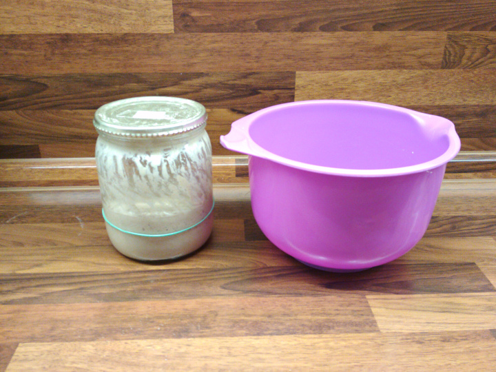

Okolo 20:00 treba zacat robit "rozkvas":

* 150g hladkej muky

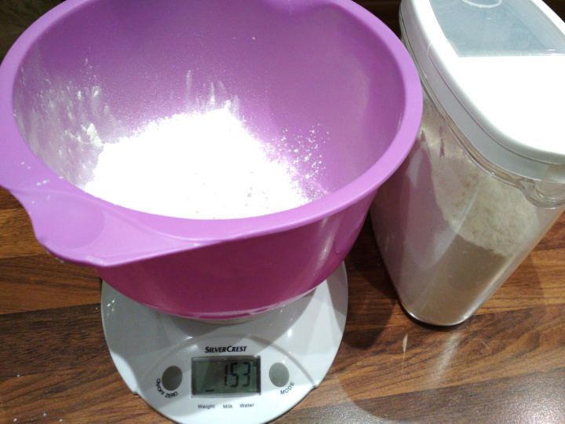

* 40g cukru

* 65g vody

* 1 polievkovej lyzice kvasku

Zmiesame to dokopy (naprv lyzicou, ktorou som nabral kvasok - kto bude tolko veci umyvat).

Potom do toho zapojime ruku (recept je vhodny aj pre lavakov). Prelozim z jednej strany na druhu a pritlacim.

Finalny stav rozkvasu vyzera takto:

Potom to zakryjeme a na 12 hodin nechame spinkat.

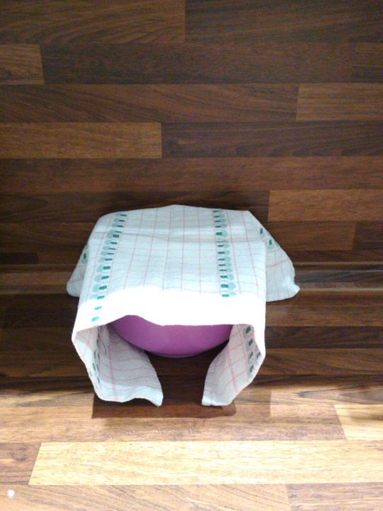

## Day 2

Po 12 hodinach rozkvas vyzera takto:

Ideme pripravit "sladke mlieko":

* 100g masla

* 100g cukru (nemusi byt hnede - ine som nemal doma)

* 130ml mlienka

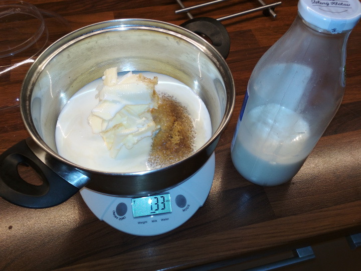

* 1 zltok

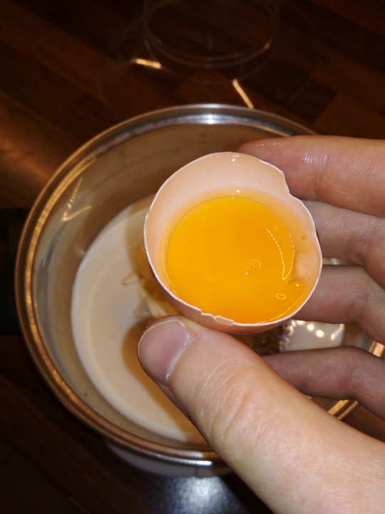

Sladke mlieko dame varit, kym sa neroztopi v nom cukor a maslo:

Ked to vyzera, ako fazulova polievka, tak este treba varit dalej:

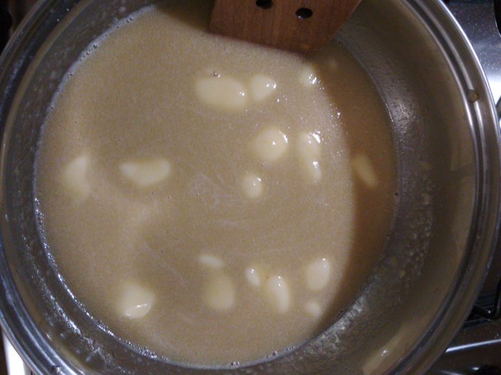

Hotove sladke mlieko:

Je to horuce, tak to dame vychladnut - napr. na balkon. Raz za 5 min to trosku rozmiesame. Za takych 20-30min je to ready.

Ideme zmiesat cesto. Do nadoby s rozkvasom pridame:

* 300g hladkej muky

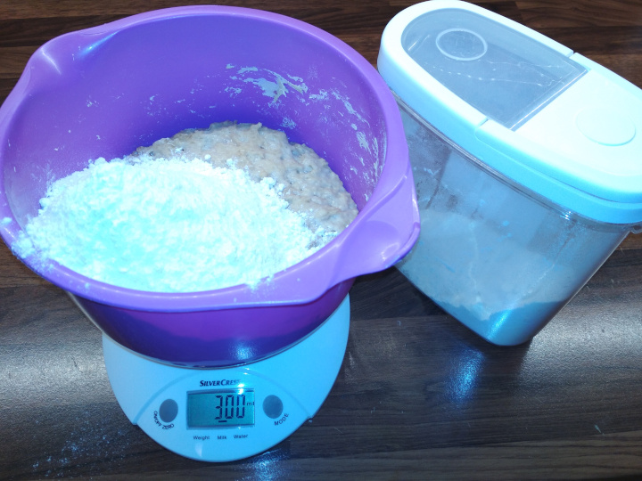

* Stipku soli - tj kolko sa nam zmesti medzi 2 prsty

* Stipku vanilkoveho cukru - tj kolko sa nam zmesti medzi 2 prsty. Moj vanilkovy cukor je len obycajny cukor zmiesany s vanilkou.

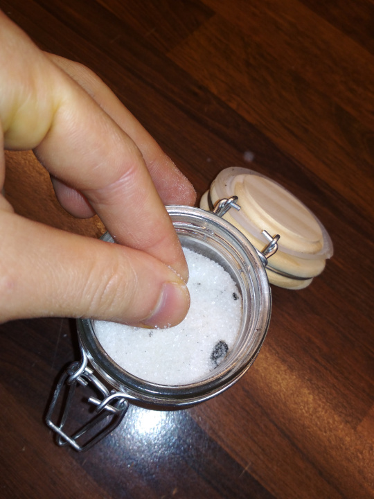

* Sladke mlieko - pozri, ako sa tesi!

Aaaa zacneme miesat cistou rukou:

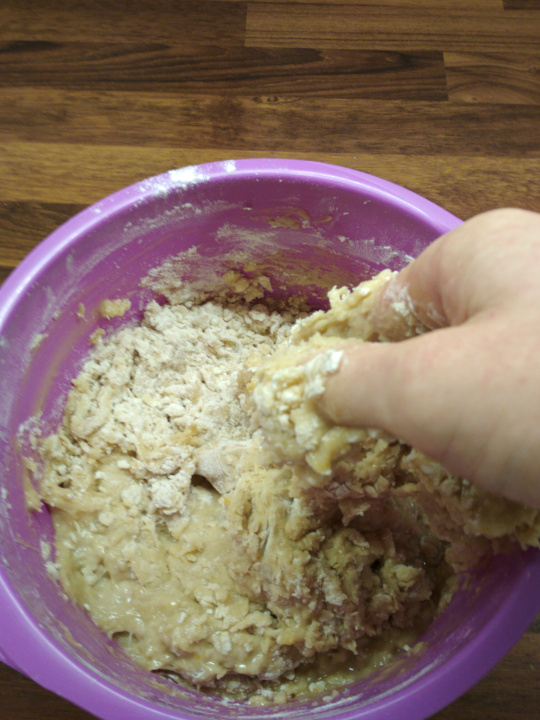

Vysledkom ma byt taketo relativne tuhe a mastne cesto:

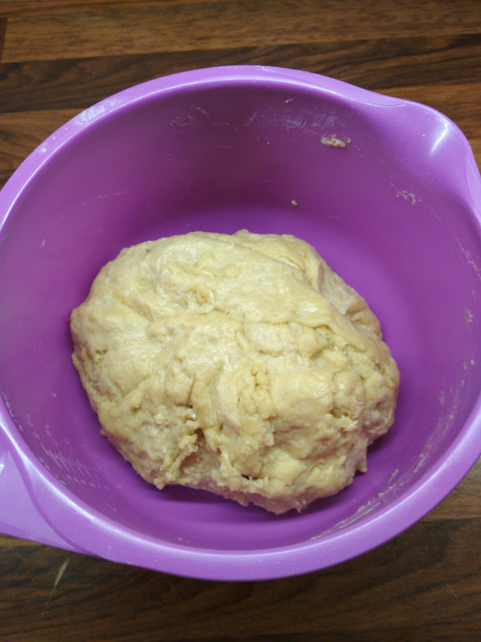

Cesto zakryjeme a nechame pracovat na 1 hodinu. Po 1 hodine to vyzera takto:

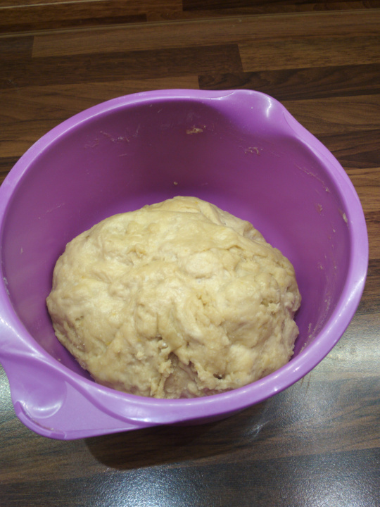

Cesto trosku zmasirujeme - prelozime z jednej strany na druhu a pritlacime. Potom cesto zase zakryjeme a nechame dalej pracovat 1 hodinu.

Po 2 hodinach cesto vyzera takto:

Cesto trosku zmasirujeme - prelozime z jednej strany na druhu a pritlacime. Potom cesto zase zakryjeme a nechame dalej pracovat 1 hodinu.

Po 3 hodinach cesto vyzera takto:

Cesto rozdelime podla vahy na 6 rovnakych casti (cca 155g/kus):

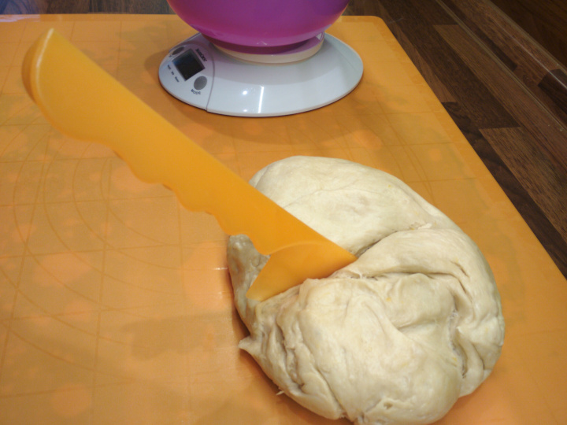
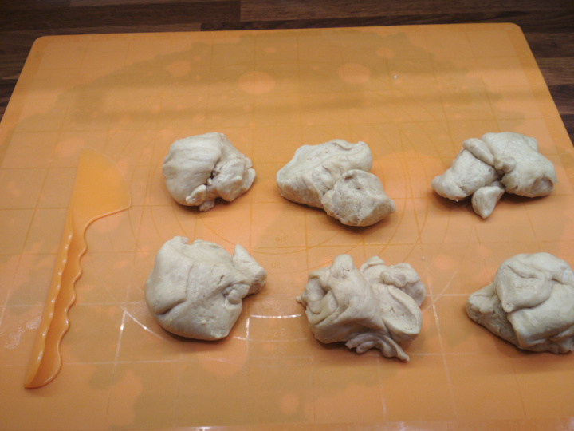

Z jednotlivych casti spravime gule. Rukou ich postlacame a zrolujeme do gule:

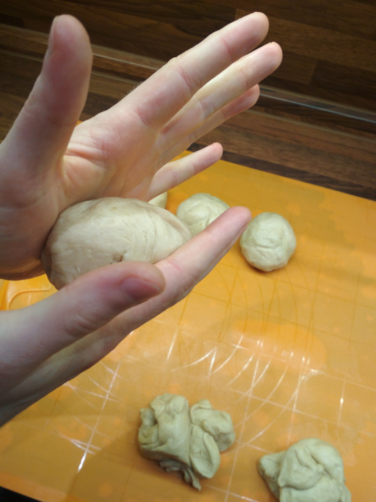

Potom tie gule zakryjeme na 20 minut:

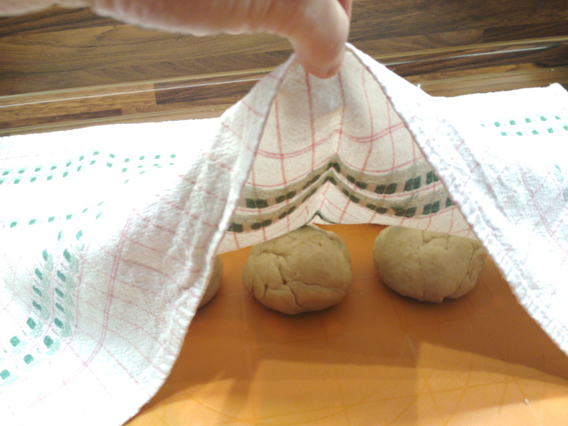

Po 20 minutach ideme konecne na to. Kazdu gulu zrolujeme do "pramenov". Naraz aj rolujeme, at stlacame cesto. Najprv jednou rukou (na zaciatku rolovania mame zavrete prste a potom ich postupne otvarame a tym roztahujeme cesto. Aplikujeme pri tom aj tlak).

Potom pouzijeme obe ruky a nadalej rolujeme, roztahujeme to cesto:

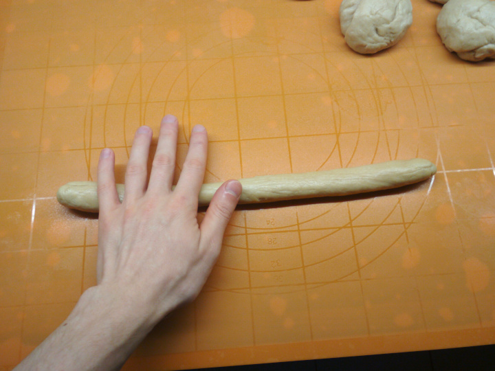

Nachystame plech s papierom na pecenie. Kedze sme ekologicki, tak pouzijeme uz pouzity papier (vsimni si flak od chleba).

Jednotlive prame rozdelime do dvoch skupin po 3 a konce spojime/stlacime:

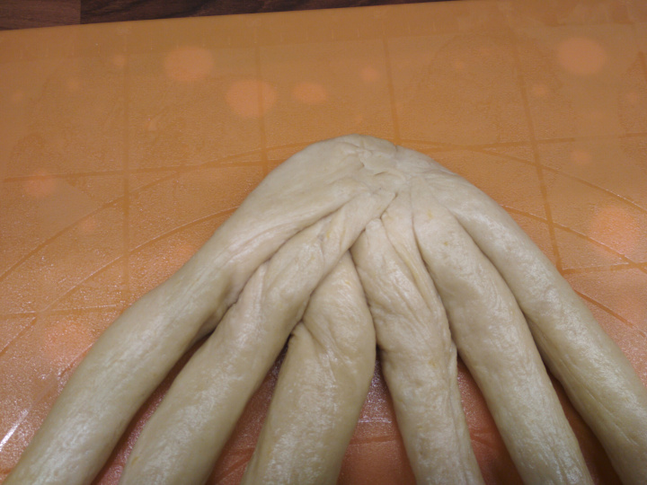

Ideme na pletenie. Kazdy pramen je na pozicii L1-L3 a P1-P3 (cislo 1 je na kraji na oboch stranach):

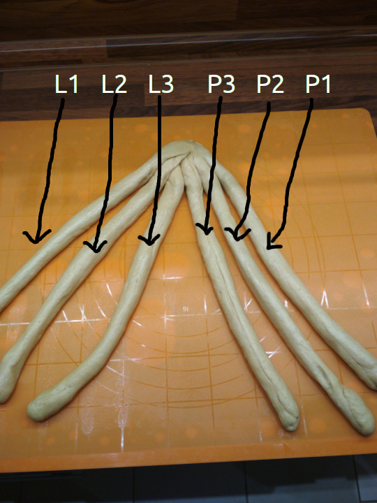

Posun L1 -> P1 vyzera takto:

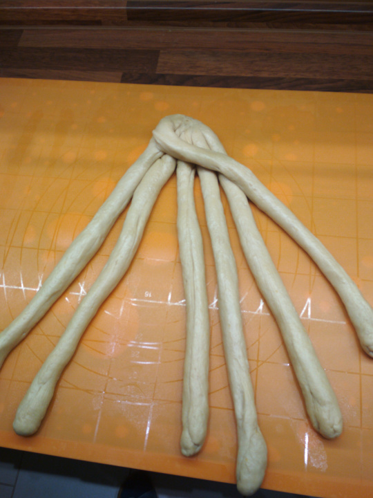

To znamena, ze zoberem pramen na pozicii L1 a dam na P1. Tym padom pramen, ktory bol predtym na L2 je uz po novom na pozicii L1. Takto miesam jednotlive pramene.

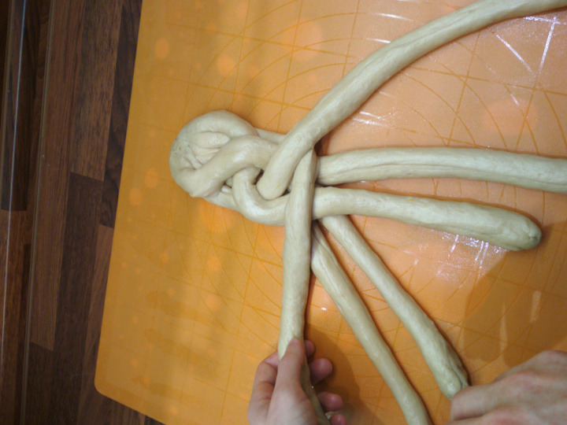

Pletenie robim v takomto poradi:

* L1 -> P1
* P2 -> L1
* P1 -> P3
* L2 -> P1
* L1 -> L3
* P2 -> L1
* P1 -> P3
* L2 -> P1
* L1 -> L3
* P2 -> L1
* P1 -> P3
* L2 -> P1
* L1 -> L3
* P2 -> L1
* P1 -> P3

Ak na konci este ti zostalo z pramenov, tak treba od zaciatku pokracovat. Konce spojime stlacenim:

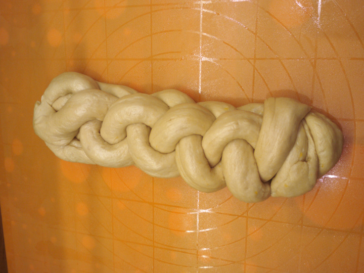

Potom opatrne polozime vianocku na plech:

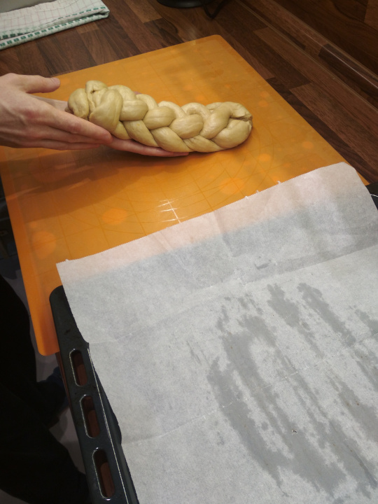
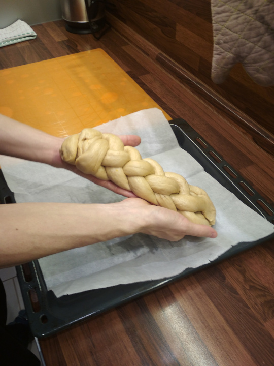
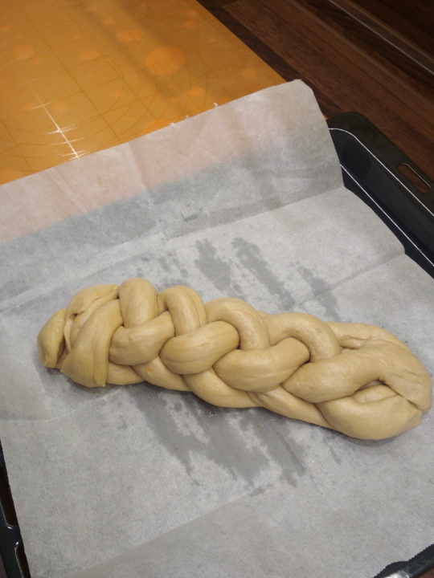

Vianocku zakryjeme a nechame pracovat 4 hodiny.
